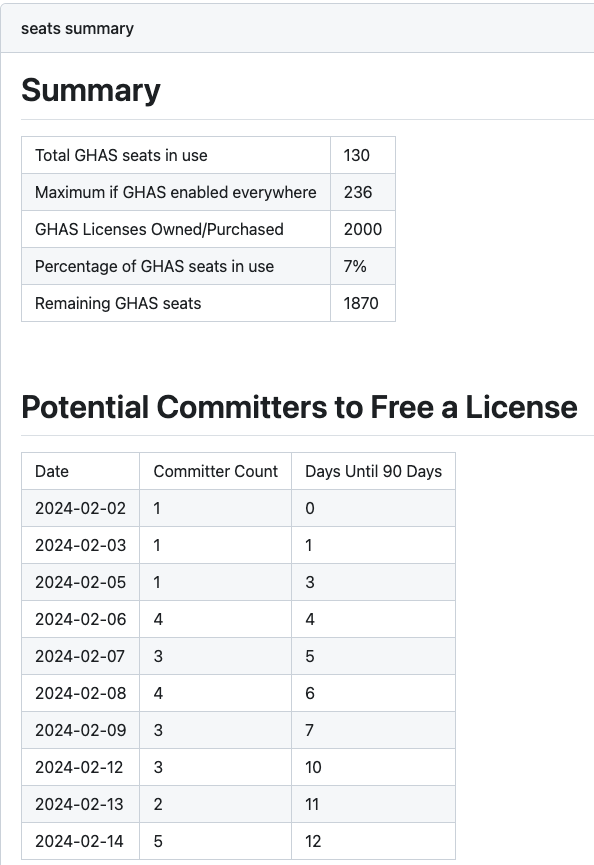

# GHAS Seat Count Action

An [Action](https://docs.github.com/en/actions) to get the number of GHAS seats and optionally calculate the percentage used as well as the number of seats remaining.

> **Warning**
> Because the GitHub API does not return the maximum number of seats in your current plan at the organization level you will need to specify this as an input to the action via the `max_advanced_security_committers` variable.  This is not necessary at the enterprise level.  

## Usage
Create a workflow (eg: `.github/workflows/seat-count.yml`). See [Creating a Workflow file](https://help.github.com/en/articles/configuring-a-workflow#creating-a-workflow-file).

### PAT(Personal Access Token)

You will need to [create a classic PAT(Personal Access Token)](https://github.com/settings/tokens/new?scopes=admin:org) that has `admin:org` access for organization-level reporting or `manage_billing:enterprise` for enterprise-level reporting.

Add this PAT as a secret so we can use it as input `github-token`, see [Creating encrypted secrets for a repository](https://docs.github.com/en/enterprise-cloud@latest/actions/security-guides/encrypted-secrets#creating-encrypted-secrets-for-a-repository). 


### Organizations

If your organization has SAML enabled you must authorize the PAT, see [Authorizing a personal access token for use with SAML single sign-on](https://docs.github.com/en/enterprise-cloud@latest/authentication/authenticating-with-saml-single-sign-on/authorizing-a-personal-access-token-for-use-with-saml-single-sign-on).


#### Example
```yml
name: Check GHAS Seats
on:
  schedule:
    - cron: 0 0 * * *
  workflow_dispatch:

jobs:
  seats:
    runs-on: ubuntu-latest
    steps:
      - uses: actions/checkout@v4
      - uses: austenstone/ghas-seat-count-action@v2
        id: seats
        with:
          org: octodemo
          github-token: ${{secrets.TOKEN}}
          max_advanced_security_committers: 200
    outputs:
      percentage: ${{steps.seats.outputs.percentage}}
      remaining: ${{steps.seats.outputs.remaining}}
      maximum_advanced_security_committers: ${{steps.seats.outputs.maximum_advanced_security_committers}}
      purchased_advanced_security_committers: ${{steps.seats.outputs.purchased_advanced_security_committers}}
      total_advanced_security_committers: ${{steps.seats.outputs.total_advanced_security_committers}}
  more-than-90-percent:
    needs: [seats]
    if: needs.seats.outputs.percentage > 90
    runs-on: ubuntu-latest
    steps:
      - run: echo More than 90% of seats used!
```

To count the total seats in the enterprise instead of an org specify the enterprise input variable instead.  Note you do not need to specify `max_advanced_security_committers` when reporting at the enterprise level.  
```yml
        with:
          enterprise: github
```

To save a CSV with the latest push date for each user you can upload as an artifact: 

```yml
    steps:
      - uses: actions/checkout@v4
      - uses: austenstone/ghas-seat-count-action@v2
        ...
      - uses: actions/upload-artifact@v4
        with:
          name: committer-last-pushed
          path: committer-last-pushed.csv
          retention-days: 30
```

## Example Notification Actions
Use this action in combination with other actions to notify users.
- [slack-send](https://github.com/marketplace/actions/slack-send)
- [send-email](https://github.com/marketplace/actions/send-email)
- [jira-create-issue](https://github.com/marketplace/actions/jira-create-issue)

## Example Workflow Output

Here is an example of the summary that is output when looking in the workflow run.



## ➡️ Inputs
Various inputs are defined in [`action.yml`](action.yml):

| Name | Description | Default |
| --- | - | - |
| github&#x2011;token | Token to use to authorize. | ${{&nbsp;github.token&nbsp;}} |
| org | The org to use for the action | N/A |
| enterprise | The enterprise to use for the action (overrides org) | N/A |
| max_advanced_security_committers | The maximum number of advanced security committers (auto-calculated for enterprise) | N/A |

## ⬅️ Outputs
| Name | Description |
| --- | - |
| total_advanced_security_committers | The total number of seats. |
| maximum_advanced_security_committers | The maximum seats if GHAS is turned on for all committers |
| purchased_advanced_security_committers | The number of seats purchased |
| percentage | The percentage of total seats used. |
| remaining | The number of remaining seats. |

## Further help
To get more help on the Actions see [documentation](https://docs.github.com/en/actions).
